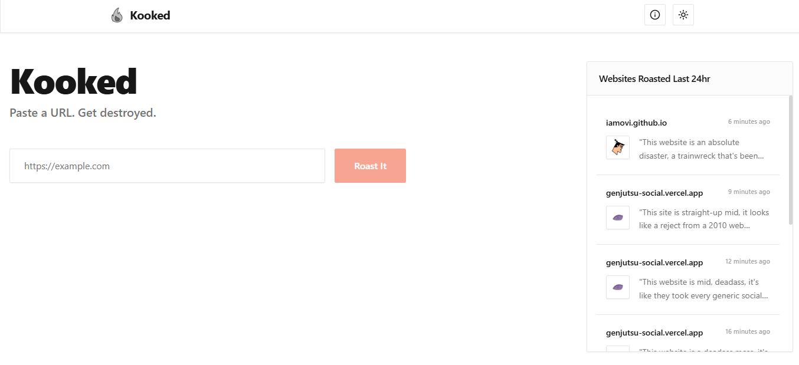

`Kooked` is an AI-powered website roaster. Paste any URL and the app scrapes the site's content, feeds it to a large language model, and delivers a long, ferociously sarcastic, deeply detailed critique — complete with a shareable link to the full roast.

## Live App

**https://kooked.vercel.app**

## Features

- **Brutal AI Roasts** — Three extensive, highly detailed roast paragraphs generated by LLaMA 3.3 70B, explicitly prompted for maximum sarcasm and word count.
- **Saving Grace** — Every roast ends with at least one kind thing to say. (Sometimes.)
- **Website Favicon Fetching** — Each roast card displays the target site's real favicon via Icon.Horse.
- **Shareable Roast Pages** — Every roast gets a unique URL (`/roast/[id]`) that anyone can open directly.
- **Global History Feed** — A live sidebar showing all websites roasted in the last 24 hours, auto-updated via Supabase Realtime.
- **Dark / Light Mode** — Clean monochrome toggle with a single fiery orange accent color throughout.

## Tech Stack

| Layer | Technology |
|---|---|
| Frontend | Next.js 15 (App Router), React, Tailwind CSS |
| UI Primitives | Radix UI Dialog |
| Backend API | Supabase Edge Functions (Deno) |
| AI | Groq API — Meta LLaMA 3.3 70B Versatile |
| Web Scraping | Jina Reader API (`r.jina.ai`) |
| Database | Supabase PostgreSQL + Realtime |
| Favicon Service | Icon.Horse |
| Icons | Lucide React |

## Local Development

### Prerequisites
- Node.js v18+
- Supabase CLI
- Groq API Key

### Installation

1. Clone this repository and navigate to the project root.
2. Install dependencies:
   ```bash
   npm install
   ```
3. Create a `.env.local` file in the root:
   ```env
   NEXT_PUBLIC_SUPABASE_URL=https://your_project_id.supabase.co
   NEXT_PUBLIC_SUPABASE_ANON_KEY=your_supabase_anon_key
   ```
4. Start the dev server:
   ```bash
   npm run dev
   ```
   The app will be available at http://localhost:3000.

### Database Setup

The global history feed requires a PostgreSQL table with an automated 24-hour cleanup job.

1. Ensure your Supabase project is linked.
2. Push the migrations via CLI:
   ```bash
   npx supabase db push
   ```
   *Or manually run the SQL files in `supabase/migrations/` via your Supabase Dashboard SQL Editor.*

### Edge Function Deployment

The AI prompt, API key, and roasting logic live exclusively in a Supabase Edge Function — never exposed to the client browser.

1. Authenticate and link the CLI:
   ```bash
   npx supabase login
   npx supabase link --project-ref your_project_ref
   ```
2. Set your Groq API key as a secret:
   ```bash
   npx supabase secrets set GROQ_API_KEY=your_groq_api_key
   ```
3. Deploy the function:
   ```bash
   npx supabase functions deploy roast
   ```

## License

[MIT License](../LICENSE)
