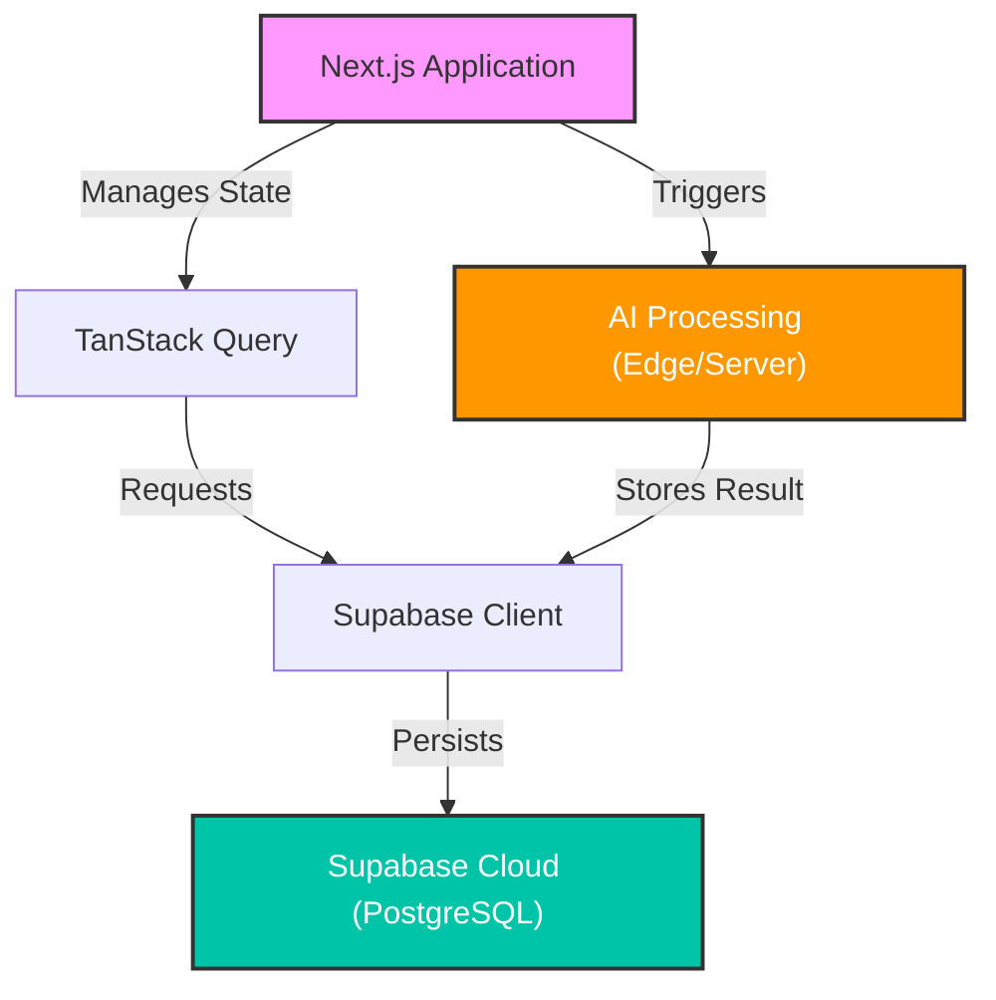
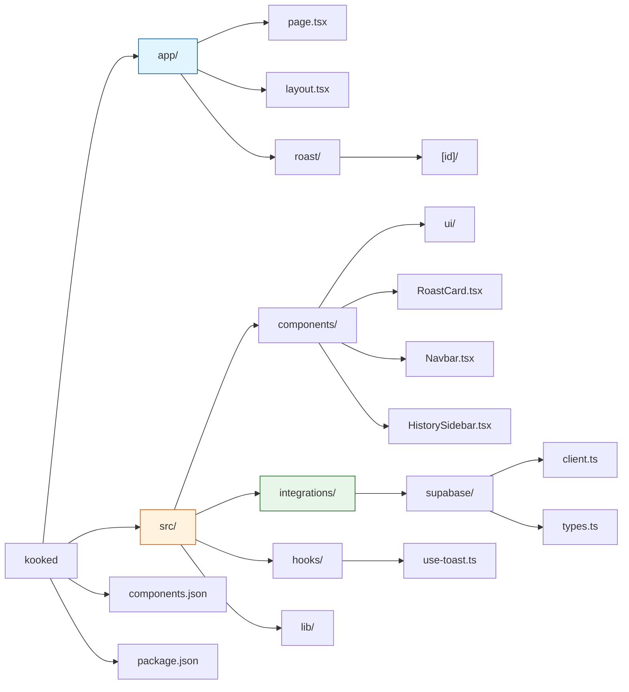
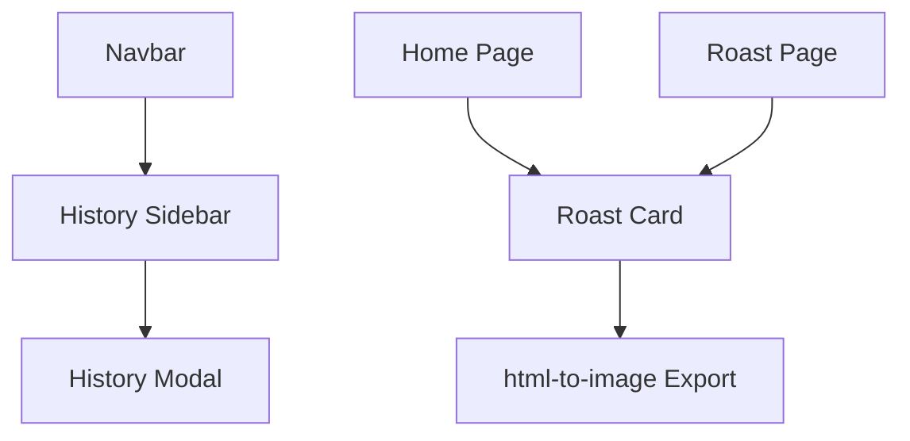
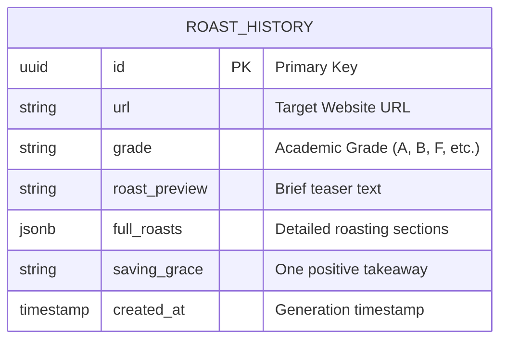

# Kooked Project Visual Map

This document provides a visual overview of the **Kooked** (Roast My Site) codebase and architecture.

## 🏗️ High-Level Architecture

The project is built with **Next.js**, utilizing **Supabase** as the primary backend-as-a-service for data persistence and **TanStack Query** for efficient client-side data fetching.

---

## 📁 File Structure Map

A clean representation of the project organization, excluding build artifacts and environment-specific files.

---

## 🧩 Component Relationships

How the main building blocks of the UI interact.

---

## 🗄️ Database Schema

The core data model for storing website roasts.

---

## 🛠️ Technology Stack

| Category | Technology |
| :--- | :--- |
| **Framework** | Next.js (App Router) |
| **Styling** | Tailwind CSS + Lucide Icons |
| **UI Components** | Radix UI / Shadcn UI |
| **Data Fetching** | TanStack Query (@tanstack/react-query) |
| **Backend** | Supabase (Database & API) |
| **Export** | html-to-image |
| **Form Management** | React Hook Form + Zod |
